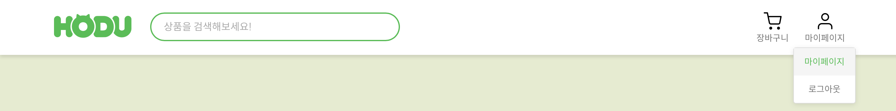

# Opne Market Service

### 🌐 배포 URL

[Open Market Service 바로가기](https://yewonni.github.io/market-service/)

## 📌 프로젝트 소개

오픈 마켓 서비스는 사용자가 다양한 상품을 구매하고 판매할 수 있는 온라인 마켓 플랫폼입니다.  
구매회원은 상품을 장바구니에 담거나 구매할 수 있으며, 판매회원은 직접 상품을 등록하여 판매할 수 있습니다.

**[테스트 계정]**

- **구매자 계정**

  - **ID**: client / **PW**: client4989

- **판매자 계정**
  - **ID**: host / **PW**: host4989

## 🏗 개발 환경

### Frontend

- **프레임워크/라이브러리**: React
- **스타일링**: Styled Components / Global CSS
- **라우팅**: React Router
- **상태 관리**: Context API
- **버전 관리**: Git & GitHub
- **API 통신**: Fetch API
- **배포 환경**: Netlify / Vercel

### Backend

- **백엔드**: 위니브 제공 API 활용

## 🗂️ 프로젝트 폴더 구조

```
src
├── assets
│   ├── Logo-hodu.png
│   ├── banner1.jpg
│   ├── icon-check.svg
│   ├── icon-shopping-cart.svg
│   └── ...
├── components
│   ├── Button.jsx
│   ├── Footer.jsx
│   ├── Header.jsx
│   ├── Input.jsx
│   ├── Main.jsx
│   └── ...
├── constants
│   └── api.js
├── context
│   ├── AuthContext.js
│   └── OrderContext.js
├── pages
│   ├── cartPage
│   │   ├── component
│   │   │   ├── CartItem.jsx
│   │   │   └── Cart.jsx
│   ├── error
│   │   └── ErrorPage.jsx
│   ├── join
│   │   ├── component
│   │   └── Join.jsx
│   ├── login
│   │   ├── component
│   │   └── Login.jsx
│   ├── myPage
│   │   └── MyOrderPage.jsx
│   ├── paymentPage
│   │   ├── component
│   │   └── Payment.jsx
│   ├── productDetails
│   │   ├── component
│   │   └── ProductDetails.jsx
│   ├── registerProduct
│   │   ├── component
│   │   └── RegisterProduct.jsx
│   ├── search
│   │   └── SearchResults.jsx
│   ├── sellerCenter
│   │   ├── component
│   │   └── SellerCenter.jsx
│   └── Home.jsx
├── styles
│   ├── GlobalStyle.js
│   ├── footerStyle.js
│   ├── reset.css
│   └── ...
├── utils
│   └── cookieUtils.js
├── App.js
└── index.js
```

## ✨ 페이지별 기능

### [홈 페이지]

- 배너이미지 및 오픈마켓서비스의 모든 상품을 표시합니다.
- 비로그인 / 구매회원 / 판매회원 별 HEADER를 구현하였습니다.
#### (비로그인 HEADER)


#### (구매회원 HEADER)


#### (판매회원 HEADER)


-----

### [검색 페이지]

- 오픈 마켓 상품에 대한 사용자의 검색 결과를 표시합니다.
  


-----


### [회원가입]
- 사용자는 가입 유형을 선택할 수 있습니다.
- 판매회원 가입의 경우, 사업자등록번호 및 스토어 이름이 추가로 요구됩니다.
- 이미 존재하는 아이디 / 사업자등록번호는 사용이 불가합니다.
- 가입하고자 하는 내용을 입력하는 즉시 유효성 검사가 실행됩니다.
- 회원가입에 성공하면, 로그인 페이지로 이동합니다.

  
  
  

-----

### [로그인]
- 가입 유형 별 로그인 탭이 구현되어 있습니다.
- 가입 유형과 다른 유형을 선택하여 로그인 시도 시 오류 메세지가 발생합니다.
- 로그인 버튼을 클릭하면 유효성 검사가 실행됩니다.
- 로그인에 성공하면, 홈 페이지로 이동합니다.


-----

### [상품 디테일 페이지]
- 사용자가 홈페이지에서 클릭한 상품의 판매점, 상품명, 가격을 표시합니다.
- 구매회원은 상품의 수량을 조정하여 장바구니에 담거나, 바로 구매 기능을 이용할 수 있습니다.
- 판매회원은 상품의 정보 확인만 가능하며, 수량 조정/ 장바구니/ 바로 구매 기능이 비활성화 됩니다.
- 비로그인 사용자가 장바구니 / 바로 구매를 클릭할 경우, 로그인 요청 모달이 화면에 나타납니다.
- 재고가 없는 상품의 경우, 재고 없음 메세지가 표시되며 모든 버튼이 비활성화 됩니다.


-----

### [장바구니 페이지]
- 구매회원 사용자가 장바구니에 담은 상품들을 표시합니다.
- 구매 수량 조정이 가능하며, 장바구니 상품을 제거할 수 있습니다.
- 여러 개의 상품을 선택하여 주문하거나, 개별 상품의 주문이 가능합니다.


-----

### [주문/결제 페이지]
- 주문하고자 하는 상품의 정보,수량, 배송비, 최종 결제 금액을 표시합니다.
- 구매회원은 배송정보 입력, 결제 수단을 선택, 동의하기 후 결제하기 이용이 가능합니다.
- 상품 결제에 성공하면, 마이페이지로 이동합니다.

 

-----

### [마이페이지]
- 구매회원의 주문 내역을 표시합니다.
- 주문 내역은 주문한 날짜를 최신순으로 하여, 나열됩니다.
- 주문한 상품의 정보, 배송 요청 사항, 주문 상태를 확인할 수 있습니다.


-----

### [상품 등록 페이지]
- 판매회원은 본인의 상품을 직접 등록할 수 있습니다.
- 상품 등록에 성공하면, 등록된 상품의 디테일 페이지로 이동합니다.


-----

### [판매자센터 페이지]
- 판매회원은 본인이 등록한 상품 즉, 판매중인 상품 확인이 가능합니다.
- 수정하기 기능을 이용하여 상품 정보를 수정할 수 있습니다.
- 등록된 상품을 삭제할 수 있습니다.

  

  


### [404 에러 페이지]
- 404 에러일 때 나타나는 페이지입니다.
- 메인으로 돌아가거나, 이전 페이지로 돌아가는 기능을 제공합니다.


-----


## 💥 트러블슈팅


## ✍🏻 나의 느낀 점 
  
